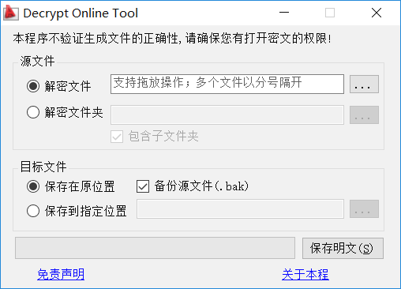

## 透明加密的原理
　　在各大制造业企业中，技术文件的保密工作非常受重视。  
　　传统的文件加密解密方案是通过出入密码的方式实现的，但对于每天都有大量文件要处理的企业来说，反复输入密码是非常不方便的，也不能防范员工将解密后的文件泄露出去。  
　　而采用消息钩子机制的透明加密方式很好地解决了这个问题。文件在磁盘上以密文方式存储，打开时首先被加密软件客户端注入的钩子（hook）截获，解密成明文后再提交给相应程序；保存时同样被钩子截获，加密后再保存到磁盘上。整个加密和解密的过程，对用户是透明的，用户几乎感受不到加密解密程序的存在。而且能很好地保护加密文件，外泄的密文不能被外界轻易解密。  
  
## 透明加密的破解方法
　　知道了原理，破解这种加密方式就不难了。  
　　对于使用内核钩子的加密方式，以“GS-DES大天图文档安全管理系统”（客户端为DES5.0版本）为例，破解方法如下：首先让应用程序打开文件，再摘除加密程序注入的内核钩子（基本都是SSDT hook），再保存文件即可得到明文。摘除内核钩子后有个遗留问题，就是应用程序打不开加密文件了，这需要重新运行加密程序客户端，或者干脆重启系统。  
　　对于进程内挂钩的加密方式，以“敏捷安全卫士AgileDG”（客户端为DG8.0版本）为例，破解方法如下：首先让应用程序打开文件，再摘除被保护的应用程序进程中对应的API钩子，再保存文件即可得到明文。这种方式破解起来有个方便之处，就是重新运行应用程序即可打开加密文件，而不需要重启加密程序客户端。  
　　另外，很多加密客户端防截屏会采用全局消息钩子的方式（比如屏蔽键盘上的Screen键），同样摘除钩子可解决。其它加密方式、屏蔽U盘、屏蔽特定程序执行等等，万变不离其宗。举一反三，灵活运用，各种透明加密不在话下。  
　　这里推荐两款ARK工具——“XueTr”（现在改名“PCHunter”）、“PowerTool”，反挂钩的利器！具体用法不讲了，怕被和谐。  
  
## 关于本工具
  
　　经笔者试验发现，透明加密程序会对指定程序的特定输出格式不加密。如，AutoCAD的输出txt文本文件，是以明文输出的。这样，本工具以仿冒AutoCAD的方式，骗取明文输出解密后的文件。  
　　[点击这里下载本工具](https://gitee.com/liuweilhy/Decrypt/releases)    
　　本工具对外开源，Git地址为：[https://gitee.com/liuweilhy/Decrypt.git](https://gitee.com/liuweilhy/Decrypt.git)  
　　注意：此工具是本人在2014年用Visual Studio 2013开发的C#程序。如果在VS2017下重新编译需要重定解决方案，否则会报错。  

## 免责声明
　　本人不对他人以本文提供的方法做出的任何事付法律责任！请诸位遵纪守法，谨慎使用！非法破解后果很严重！  
